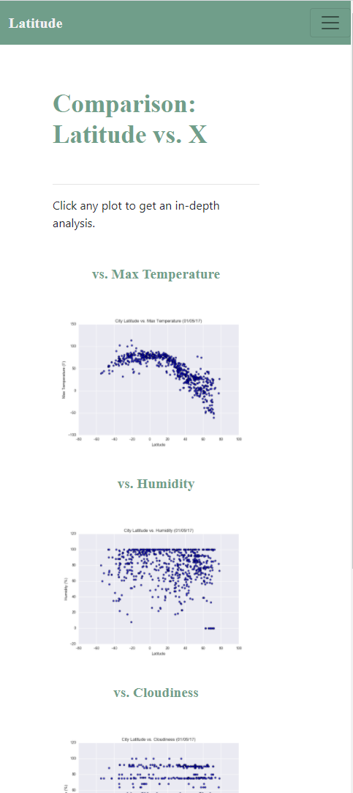
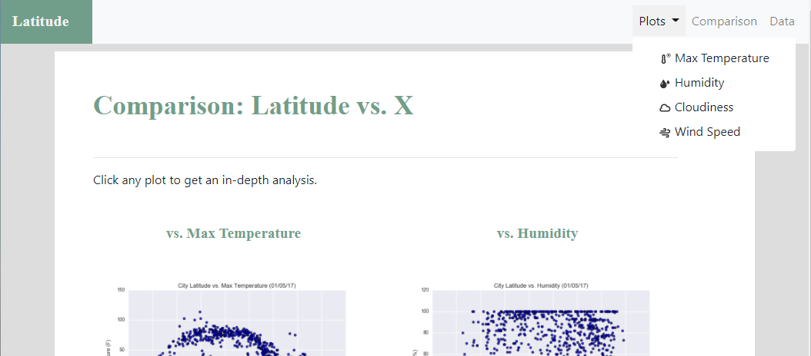
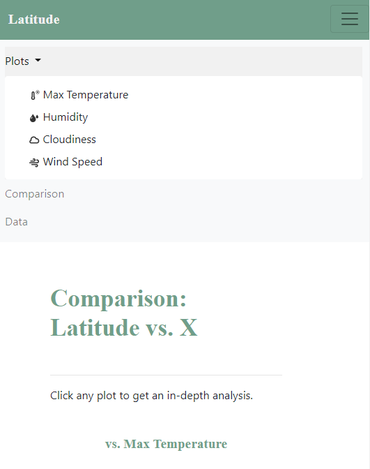

# Web-Design-Challenge

## Latitude - Latitude Analysis Dashboard with Attitude

In this project, a visualization dashboard website has been created using visualizations related to weather data.
In building this dashboard, there are individual pages for each plot and a navigation between them. These pages contain the visualizations and their corresponding explanations. There is a landing page, a page for a comparison of all of the plots, and another page to view the data used to build them.

* Landing page containing:

    1. An explanation of the project.
    2. Links to each visualizations page. There should be a sidebar containing preview images of each plot, and clicking an image should take the user to that visualization.

    

*  Visualization pages, each with:

    1. A descriptive title and heading tag.
    2. The plot/visualization itself for the selected comparison.
    3. A paragraph describing the plot and its significance.

    

*  Comparisons page:

    1. Contains all of the visualizations on the same page so we can easily visually compare them.
    2. Uses a Bootstrap grid for the visualizations. The grid is two visualizations across on screens medium and larger, and 1 across on extra-small and small screens.

    

    

*  Data page:

    1. Displays a responsive table containing the data used in the visualizations.
    2. The table is a bootstrap table component. 
    3. The data come from converting cities.csv file to HTML. I used pandas in jupyter noptebook to achive this. It generates a HTML table from a pandas dataframe and saving it into table.html. Then table.html has been imported into data.html.

    

* There is a a navigation menu used at the top of every page. it has been saved into header.html and then it has been imported into all pages in the website. This navigation menu:
    1. Has the name of the site on the left of the nav which allows users to return to the landing page from any page.
    2. Contains a dropdown menu on the right of the navbar named "Plots" that provides a link to each individual visualization page.
    3. Provides two more text links on the right: "Comparisons," which links to the comparisons page, and "Data," which links to the data page.
    4. Is responsive (using media queries). The nav must have similar behavior as the screenshots "Navigation Menu" section (notice the background color change).
    5. Includes a few glyphicons used next to links in the header.

    

    

Finally, the website is deployed to GitHub pages.

